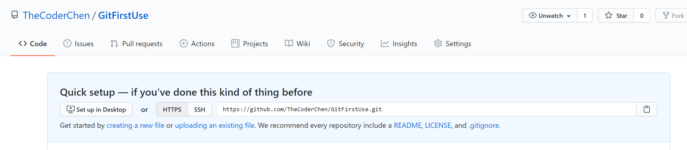

# Git/GitHub使用方法与常见错误

## 一、初始化本地库
#### 1. 进入本地库目录并打开 GitBush
#### 2. 执行本地库的初始化
```git
$ git init
```

> 效果：本地库初始化，在此文件目录下生成 .git 隐藏文件，并将自身的本地库命名为 main
#### 3. 设置签名：项目/仓库级别 与 系统用户级别
```git
$ git config user.name <user name>
$ git config user.email <user email>
```
> 信息保存位置：./.git/config 文件
```git

$ git config --global user.name <user name>
$ git config --global user.email <user email>
```
> 信息保存位置：~/.ginconfig 文件

## 二、将文件提交到本地库

#### 1. 将待加入文件放入本地库目录中，输入下面的命令来将文件加入缓冲区
```git
$ git add <file_name>
```
> 将文件从缓冲区移出输入以下命令：
```git
$ git rm --cached <file_name>
```
#### 2. 提交缓冲区文件
```git
$ git commit -m"<message information>" <file name>
```

> **修改文件：**
> 修改文件后提交进入本地库可以直接执行下面操作：
> ```git
> $ git add <file name>
> $ git commit -m"<message informatin>" <file name>
> ```
> 或者可以直接：
> ```git
> $ git commit -m"<message information>" <file name>
> ```
##### *查看仓库状态
输入下面的命令:
```git
$ git status
```
## 三、创建远程库
#### 1. 在 GitHub 建立远程仓库
具体操作在 GitHub 处执行
#### 2. 在本地创建远程库地址别名
获取GitHub上的远程库地址

输入下面的命令：
```git
$ git remote add origin https://github.com/TheCoderChen/GitFirstUse.git
```

## 四、推送操作：
#### 将本地库内容推送进入远程库
输入下面的命令：
```git
$ git push origin main
```
> 注意在推送前，确保本地库中的内容与远程库一致，否则需要率先执行下面的命令：
```git
$ git pull --rebase origin master
```

### 待解决的问题与目前解决方法：
#### 一、Push 后报错
具体报错信息：
```git
unable to access '<远程库地址>': OpenSSL SSL_read: Connection 
was reset, errno 10054
```
目前解决方法：
输入命令：
```git
$ git config --global http.sslverify "false"
